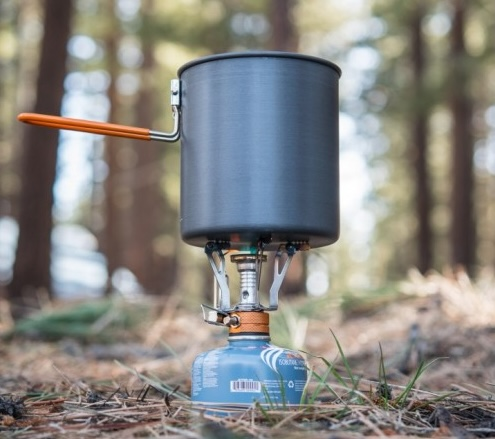
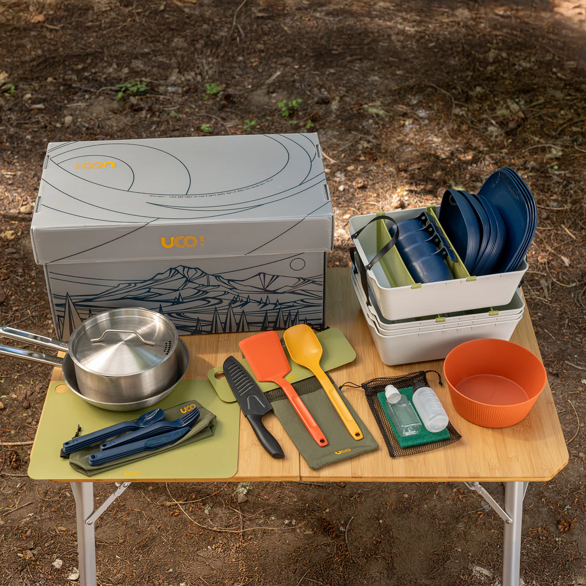
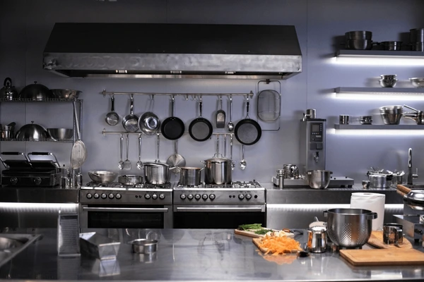
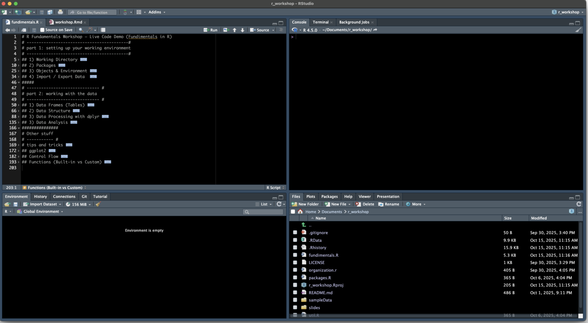

```{r setup, include=FALSE}
knitr::opts_chunk$set(echo = TRUE)
library(tidyverse)
options(readr.show_col_types = FALSE)
```

class: title-slide

<br><br>

# R Workshop
## The Basics
### Saryu Onishi
???
- c to clone (mirror display)
- p to move to presenter mode (make one display a presenter display)
---
# Introduction
Have you ever done analysis and thought: 
- “I know what I want and this point-and-click software isn’t doing what I want”
--

- “I am doing the same analysis again and again ... is there a way to automate this?”
--

<br><br>

Good news! Instead of reading through complicated documentation, you can learn a whole new programming language to recreate an analysis method to customize and automate data analysis!

<!--
this is how you comment
-->
---
# Vibe coding
* Vibe coding is the emerging practice of using AI to write code by describing what you want.

--
* It might feel like you don't need to learn the basics, but I disagree.

--
* Knowing even the basics will speed up the process **a lot**. 

---
# The scope of today's workshop
Our goal today is to build the most minimal foundation on which you can stack your coding skills onto. 
<br><br>

--
In interest of time, we will skip:

--
- Legacy basics like base subsetting - easier methods exist via *packages*.

--
- Flow control (`if/else` statements, for loops, `purrr::map()`) and custom functions 
 - *extremely* useful, but not required for basic analysis.

---
# The scope of today's workshop
.less-right[

]
--
.more-left[
In this session, we will cover:
]
--
<div class="more-left">
<ul>
<li>Introduction to R statistical programming language</li>
--
<li>Who is R for?</li>
--
<li>Fundamentals of R programming.</li>
--
<li>Writing and organization code.</li>
--
<li>Tips and tricks that I highly recommend utilizing.</li>
</ul>
</div>

---
# R programming
First, let's talk about programming

--
- Modern software (like SPSS) has a clean graphical user interface designed to make computer operations easy via point and click features.

--
- "Programming" is writing step-by-step instructions for the computer to follow. 

<br>

--
**R statistical programming language**

--
- Designed for stats (hence the popularity amongst scientists).

--
- Open-source. i.e., free to use! (unlike SPSS...)

---
# R programming
Why use R?
- Reproducable process
- Customizable features
- Ability to partially or even fully automate tasks

???
Very broadly speaking, programming is the process of writing step-by-step instructions for the computer, compared to modern software that is mostly point-and-click (user interfaces designed to make computer operations accessible).
We say “programming” and “coding”, but not all programs are the same. R is a programming language built for statistical analysis (in comparison, python is more generalist and hence, the jack of all trades, but master of none). So clearly, if you do statistical analysis, you could be using R. 
---

# Who is R for?
Ask yourself the following:

--
-	Are you doing the same analysis repeatedly? 

--
-	Do you deal with large or messy datasets?

--
-	Are there more specific things you want to do, that’s forces you to use multiple software or add-ons?

--
-	Are you particular about the way to visualize your data?

--
-	Modelling or machine learning, perhaps?

--

These are all good reasons to consider R!

---

# Who is R for?
It is also possible you might not need to learn R:

--
-	Excel or SPSS may be good enough – you know it and you don’t need much more.

--
-	Relatively simple analysis (t-test, correlation analysis) with smaller datasets.
<br>

--

Ultimately, R is another tool to use. 

--
- R won’t magically improve your analysis, but it can make your work *faster*, *cleaner*, and **reproducible**.

---

# Fundimentals of R
Here are the fundamentals of R that genAI assumes you know:
- Difference between R and R studio
- Scripts, console, terminal
- The working directory
- objects and the environemnt
- import and export data
- data structure: vectors, data frames and shape
- packages (dplyr example)
- flow control*: for and if
- functions*
---

# Difference between R and RStudio
Some people may gloss over this detail, but these are important distinctions:

--
- **R**: the programming language *and* interpreter (the engine).

--
- **Packages**: add-ons for R (e.g., tidyverse, gt).

--
- **RStudio**: an Integrated development environment, or IDE (contains the console + plots + Git)

---
# Difference between R and RStudio
- R works without RStudio; RStudio does nothing without R.
<br>

### The Kitchen Analogy

--
<div style="text-align: center;">
<div style="display: inline-block; margin: 0 20px; vertical-align: top;">
<div>R</div>

</div>
???
**the kitchen analogy**
- R is like a stove. 
 - lightweight, 
 - you can cook on it, but 
 - a little inconvenient
--
<div style="display: inline-block; margin: 0 20px; vertical-align: top;">
<div>Packages</div>

</div>
???
- R packages are like cooking utensils
 - makes it more convenient to cook
 - thats it
--
<div style="display: inline-block; margin: 0 20px; vertical-align: top;">
<div>R studio IDE</div>

</div>
</div>
???
- R studio
 - clean environment for maximum productiveity
 
---
# Please open up R Studio
.center[

]
 
---
# Scripts, Console, Terminal
.pull-left[
- The **console** is where the code runs.
 - *Note:* You can test code here, but it will NOT save.
 
- The **environment** is where stored objects appear

- The **R script** is the document your write code in ('.R' file extension)

]
 
.pull-right[

<!--  -->
]
 
---
# Working Directory 

.pull-left[
- The folder which R works out of.
- Important for when you read and write data.
- Can be set with a file path
 - e.g.: `“/Users/saryu/Desktop”`
]

--
.pull-right[
**Code example:**
```{r}
# to check wd
getwd() 

```
]

???
The working directory is the folder that R uses as a reference point. (This is an important concept to understand when importing data).<br>
Before working, you may need to "set" the working directory. You can do this by clicking buttons, but code is more reproducible.
- To check file path, you can look at folders (Windows) or finder (MacOS).
- File paths written as folders separated by forward slashed (e.g., “/Users/saryu/Desktop”)

---
# Working Directory 

.pull-left[
- The folder which R works out of.
- Important for when you read and write data.
- Can be set with a file path
 - e.g.: `“/Users/saryu/Desktop”`
]
.pull-right[
**Code example:**
```{r}
# to check wd
getwd() 

# to set wd
# setwd(“path/to/your/directory”)
# setwd("~/OneDrive - University of Oklahoma/r workshop")
```
]

---
# Working Directory
Now that you know about working directories, let's organize our projects well:

--
- **Sample folder structure:**

--
  - `data/raw/` - original, untouched data files
  
--
  - `data/clean/` - processed, analysis-ready data
  
--
  - `output/` - figures, tables, results
  
--
  - R scripts in the project root to easily access folders

--
- **Use relative paths** - makes your code portable and reproducible
  - `C:/Users/YourName/Documents/data.csv` -> `data/raw/data.csv`
  - setting working directory (`setwd()`) allows us to use relative paths.
  
---
# R Projects: The Modern Approach

**Instead of using `setwd()`, you can use R Projects (`.Rproj` files)**

.pull-left[
**Benefits:**
- Automatically sets working directory to project folder
- Makes your code more portable and reproducible
- Keeps everything self-contained
- Easy to switch between projects
]

--
.pull-right[
**How to create:**
1. File → New Project
2. Choose location
3. Name your project
4. RStudio creates a `.Rproj` file

**Always open your project by double-clicking the `.Rproj` file!**
]

---
# Packages
R is great because there are loads of packages to do various things. In these packages are loads of custom functions that enable you to take shortcuts – just like in Microsoft Excel. 

--

base R has loads of useful functions, but these packages will make your life even easier:

- `tidyverse` should always be loaded in most of our use cases: handles most data wrangling and visualization tasks
 - Contains `readr`, `dplyr`, `ggplot2`, `tidyr`, `purrr`, `tibble`, `stringr`, `forcats`
- other useful packages:
 - `stats`, `rstatix`, `psych`, `ggsignif`
???
remeber the kitchen analogy?

---
# Packages
Before using a package, you have to 
- download it onto your computer. The `install.packages()` function does this.
```{r}
# install.packages("tidyverse")
```
 - Note: you only have to run this once per computer
 
- load it into your session environment
```{r}
library(tidyverse) 
```
 - Note: you have to do this *every* new session
 
---
# Objects and Environment
.pull-left[
Data and outputs should always be stored.
- This allows you to recall data.
- Data can be done by creating an **object** using `<-` or `=`
 
**Note:** Object names should be as descriptive as possible.
]

--
.pull-right[
**Code example:**
```{r}

n <- 5

numbers <- c(1, 3, 5, 7)

```
]
???
In R, data and outputs can be stored in *objects*. 
- This allows users to refernce it later
This is done by assigning with the assignment operators “<-“or “=”
- It is best practice to make sure object names are as descriptive as possible
Objects are stored in the *environment* of a session. This is one of the four quadrants of the R studio IDE.

**tip: ** double click the object to view()

---
# Objects and Environemnt
.pull-left[
Data and outputs should always be stored.
- This allows you to recall data.
- Data can be done by creating an **object** using `<-` or `=`
 
**Note:** Object names should be as descriptive as possible.
]
.pull-right[
**Code example:**
```{r}

n <- 5

numbers <- c(1, 3, 5, 7)

n

numbers

# print(numbers * n)
```
]

---
# Import and Export Data
.pull-left[
To begin analysis, you must import data from a specific folder.
- To import data, you need: 
 - the file path (`/folder/filename.csv`)
 - a read function (`read_csv()`)

]
.pull-right[
**Code example:**
```{r}
# to import data
data <- readr::read_csv("data/sample/cleanData.csv")
# for excel files (gross) use readxl::read_xlsx("sample/cleanData.xlsx")
head(data[1:4])
```
]

???
import data is often the first hurdle. Like setting working directory, you can do this by clicking buttons, but coding it is faster – I  promise
-	When doing this, you need the file path (location of the file + file name). 
 - If you set the wd, you can use a relative path starting at the current wd.
 - If the working directory is set to the folder the file is in, the file path can simply be the file name.
- To import: `readr::read_csv(path)` or `readxl::read_excel(path)`.
-	To export: `readr::write_csv(df, path)`.

write data is useful when you process data

---
# Import and Export Data
.pull-left[
You can also write data to a specified folder.
- To export data, you need
 - data object
 - write function (`write_csv()`)
]
.pull-right[
**Code example:**
```{r}
# to import data
clean_data <- data[1:4]
write_csv(clean_data,"data/clean/workshop.csv")
```
]

---
# Data structure

.pull-left[
## Data frames
-	Data frames are R table
 - Tibbles are the modern `tidyverse` equivalent.

## Accessing columns
- Columns can be extracted with `$`
]
--

.pull-right[
**Code example:**
```{r}
gradebook <- data.frame(
  name  = c("aaron", "jacqueline", "blake"),
  score = c(55, 22, 80)
)

gradebook

gradebook$score
```
]

---
# Data structure

.pull-left[
## Data frames
-	Data frames are R table
 - Tibbles are the modern `tidyverse` equivalent.

## Accessing columns
- Columns can be extracted with `$`
]
--

.pull-right[
**Code example:**
```{r}
head(clean_data, n=3)

clean_data$mean_angle
```
]
???
Vectors are the atomic unit of R; most structures are made of vectors.
-	Vectors contain homogeneous data
- Note: *Not* the same as lists
Data frames are tables/spreadsheets in R. Very useful, especially when data wrangling with tidyverse.
- This is why a lot of sample code uses "df" for tables
- Note: this is the same as a tibble 

---
# Data structure
## Shape
-	Humans like wide data.
-	Computers like long data (each row represents a single data point).
- Knowing this can speed up workflow.

.pull-left.no-vcenter[.center[
```{r, echo=F}
trial = c("Trial 1",	"Trial 2",	"Trial 3")
bob =	c(4, 5,	4)
alice=	c(3,	4,	6)
sampledf <- data.frame(Trial=trial,Bob=bob, Alice=alice)
sampledf <-
  data.frame(Name = c('Bob', 'Alice'),
             'Trial 1'=c(4,3),
             'Trial 2'=c(5,4),
             'Trial 3'=c(4,6))
print("wide data")
print(sampledf)
```
]]
.pull-right[.center[
```{r, echo=F}
print("long data")
sampledf %>% pivot_longer(cols = -Name,names_to = "Trial",values_to="Value") %>% print()
```
]]
---
# Data structure
## Shape
.pull-left[.center[

```{r, echo=F}
sub1 <- data.frame(stage=c(1,2,3,4),hr=c(100,125,150,175))
sub2 <- data.frame(stage=c(1,2,3,4),hr=c(70,100,120,150))
print("Data sheet 1")
print(sub1)
print("Data sheet 2")
print(sub2)
```

]]
.pull-right[.center[
```{r, echo=F}
print("Add subject info column and bind rows")
sub1 %>% mutate(Subject = "subject1") %>% 
  bind_rows(sub2 %>% mutate(Subject = "subject2")) %>% 
  print()
```
]]

---
# Example: dplyr (dee-plyer)
The first thing I would learn is dplyr grammar. Its very useful and a true foundational piece of knowledge.
*Useful code:*
-	`%>%` (pipe operator): allows you to chain methods together
-	`select()` to select columns of a data frame / tibble
-	`filter()` to subset (filter) data
-	`mutate()` to add a column
-	`group_by()` and `summarize()` to summarize rows

---
# How to structure your R script
## General guidelines
-	Order is important. 
 - R executes code from top to bottom. If you call an object before creating it, you’ll get an error

--

-	Name objects descriptively, use comments and separate section for readability

---
# How to structure your R script
## Flow:

1. Always load libraries at the top - scattering it across your document can make it prone to bugs

--

2. Options (digits, scipen, etc)

--

3. Import data (into an object!)

--

4. Data cleaning and analysis

--

5. Write data to appropriate file path

???
	If csv, read_csv()
	If excel file, readxl::read_excel()
o	Clean the dataset (Rename columns, select relevant columns, filter data)
o	Conduct analysis 
o	Outputs (plots, tables, exports) should always be at the bottom.

---

# Pseudocode 
 **Plan before you code** - write your logic in plain English first!
-	Pseudocoding is the process of writing out your goals in plain English before writing the code. For example:
```{r}
# this program calculates the mean and sd of column x
# import data
## read csv
# calculation
## calculate mean of column x
## calculate sd of column x
# print results
## print message: the mean is {mean} and sd is {sd}
```

???
-	The process of pseudo-coding was introduced to me recently, and I think this is a great approach. Organization is EXTREMELY important in coding. This helps.

---

# Tips and tricks
Here are some tricks I love to use, and highly recommend you use when using R and R studio
-	Keyboard shortcuts are your friend
 - Use tab to autocomplete names to avoid typos (typos break code)
 
--
 - `cmd + enter` or `ctrl + enter` to run a line of code  
  
--
 - `cmd + shift + m` or `ctrl + shift + m` for pipe operator
  
--
 - `cmd + option + down` or `ctrl + alt + down` to duplicate line(s)
  
--
 - `cmd + shift + c` to comment out sections
  
--
 - `cmd + option + o` or `Alt + 0` to collapse all


---
# Tips and tricks
-	Use comments and headers 
 - hash (#) makes non-executable chunks – great for comments
 - 5 hashes (`#####` or `#----`) allows the section under it to be collapsed
 - Pro tip: for headers, do # section 1 #### or # section 1 ----
-	Need a reminder on how to use a function? Use the help tab (accessible by putting “?” before the function name)
-	Checking data
 - `View()` and `head()` for quick peak at the data frame. 
 - `str()` and `glimpse()` for data structure and data type 

 
---
# Tips and tricks
-	Customize your experience with `options()`
 - I like `options(readr.show_col_types = FALSE)`
 - `options(scipen = 999)` disables scientific notation
-	Use your resources. If you think to yourself “there must be a better way to do this”, there probably is. Search the internet but BE SPECIFIC with your search.
 - Instead of “clean this data”, search “reshape data from wide to long”
-	Miscellaneous
 - More lines **IS NOT** better code. Clarity > length
 - `sessionInfo()`shows your R version and loaded packages
 - restart session (`cmd + shift + 0`) – sometimes this fixes issues

---
# Tips and tricks
- Coding style is very much a thing. Like everyone, I think my style is the best style but im always open to suggestions. Generally I like to:
 - Use functions, but not too many. if I have to scroll up and down constantly just to follow the code, it’s too much.
 - New lines for new operations or long lists
 - Camel case or dot case, not snake case.
 
 
---

# Questions?

<!-- --- -->
<!-- # control structures -->
<!-- These are not necessarily “essential”, but it is very useful, especially in the context of repeated tasks. -->
<!-- ## if else statements -->
<!-- -	Execute code **if** a specified condition is met -->
<!-- ```{r} -->
<!-- value = 50 -->
<!-- weight = 50 -->
<!-- test = "shuttle run" -->
<!-- if (test == "VO2max") { -->
<!--   final = value/weight -->
<!-- } else { -->
<!--   final = value -->
<!-- } -->
<!-- ``` -->
<!-- -- -->
<!-- ```{r,echo=F} -->
<!-- print(final) -->
<!-- ``` -->
<!-- --- -->
<!-- # control structures -->
<!-- ## for loops -->
<!-- -	Repeat operations when the sequence can be specified. -->
<!-- ```{r} -->
<!-- files = 10 -->
<!-- counter <- c() -->
<!-- for (n in seq(files)) { -->
<!--   counter <- c(counter, n) -->
<!-- } -->
<!-- ``` -->
<!-- -- -->
<!-- ```{r,echo=F} -->
<!-- print(counter) -->
<!-- ``` -->
<!-- --- -->
<!-- # functions -->
<!-- - There are loads of preprogrammed functions, but you can also make your own. -->
<!--  - `library()`, `getwd()`, `read_csv()`, are all examples of functions. -->

<!-- -	Functions can reduce clutter and/or repetition, making debugging easier. -->

<!-- -	If you abide by the “functional programming” line of thinking, you utilize functions, instead of for loops to execute complex tasks.  -->
